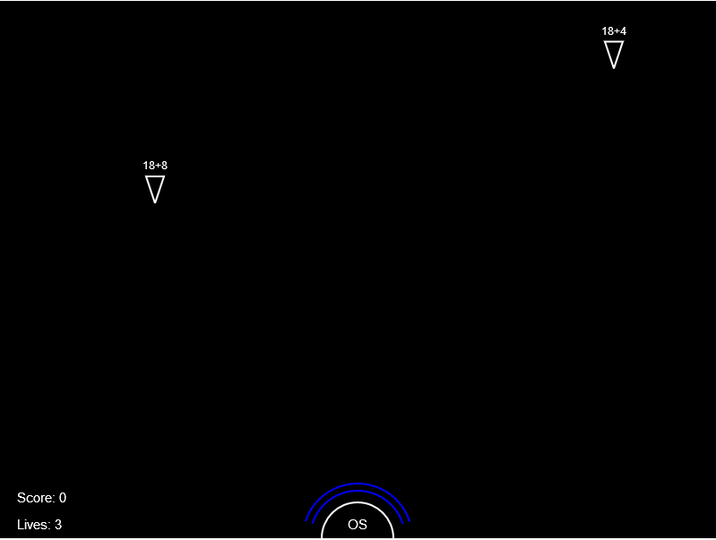

# Spacewars

Welcome commander, Earth needs you! We received an encrypted message from Mars. Alien fleet is aproaching the planet. We need to act quickly and prepare for defense.

You have been selected to command one of the Land To Space Defense Base. Our destiny is in your hands.

[Play](https://malja.github.io/web_spacewars/)

## Howto

When ship appears on the screen, you have to solve the math question above it and press **Enter**. This will shoot powerfull laser, which destroys the ship.

On the other hand, when the ship makes it to the ground, you lose one of your shields and finaly the whole game.

## Settings

Before starting the game, you can adjust some of it's settings. Here is the list:

- *Maximal number used in generator* - This limits the maximal number, which should be used in math questions.
- *Use only whole numbers calculations* - Make sure, that answers are not decimal numbers.
- *Division* - Use division operator in questions.
- *Multiplication* - Use multiplication operator in math questions.

When you are satisfied with the settings, click the "Start" button and enjoy your game.
